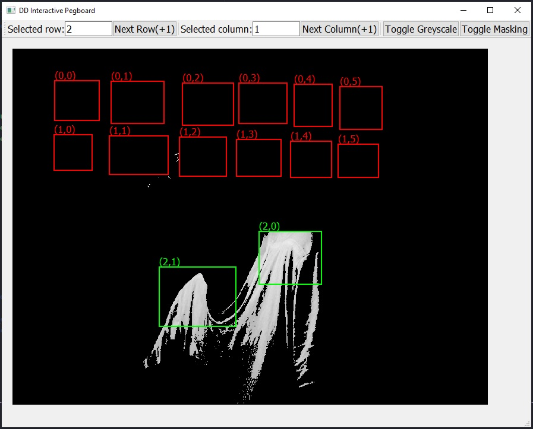

# Digital Interactive AR Pegboard
An OpenCV GUI calibration client for the Interactive Pegboard project @DeloitteDigital Melbourne office.

## How to use
To select a tile on the grid, use the selection fields or the increment Next buttons. At the start the selected row and column will be None. Once a valid tile is selected, use the mouse to draw on the canvas to define a rectangular area of where the corresponding tile is on the image.
Each tile can only have one defined region at a time.
Use the Toggle Greyscale and Toggle Mask button to toggle between image format for detection.

## How to activate Python environment
On Windows, in CMD/PowerShell run:
``pegboard-env\Scripts\activate``
On UNIX systems run:
``source pegboard-env\Scripts\activate``

